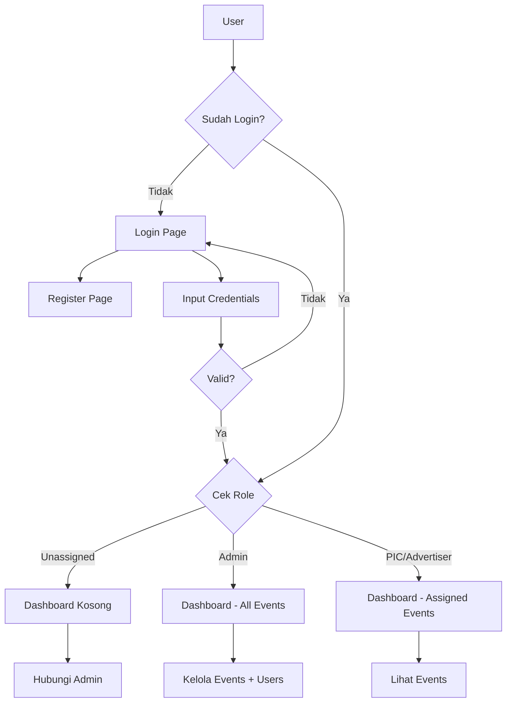
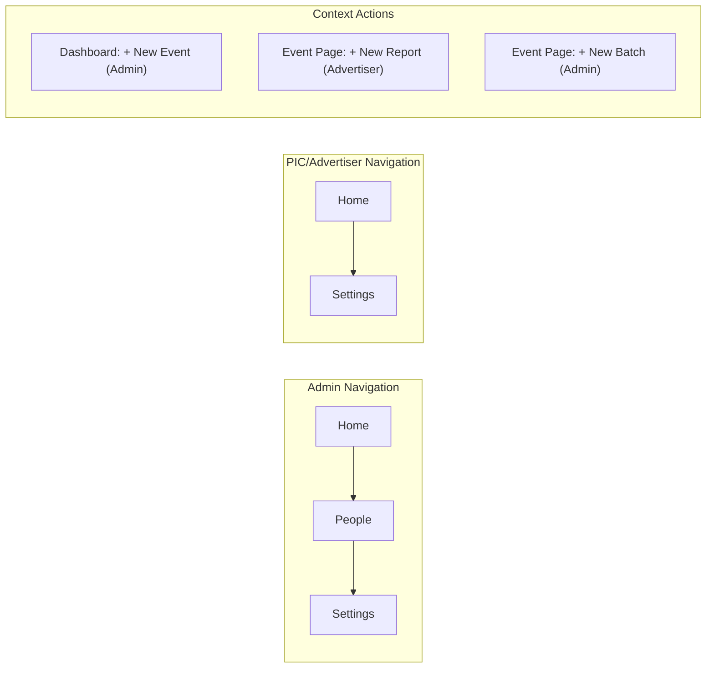
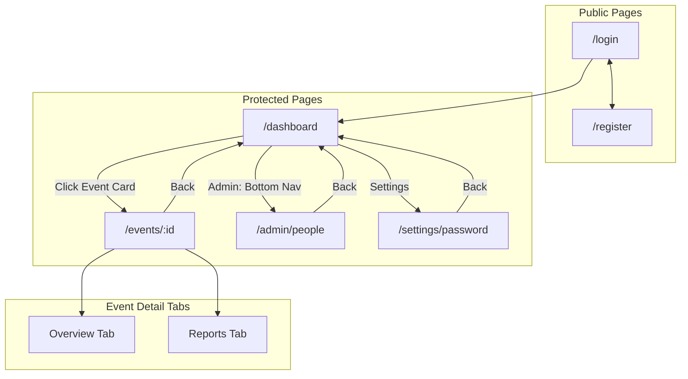
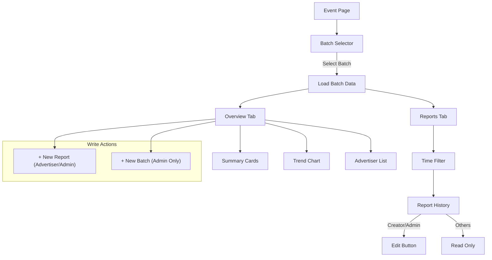
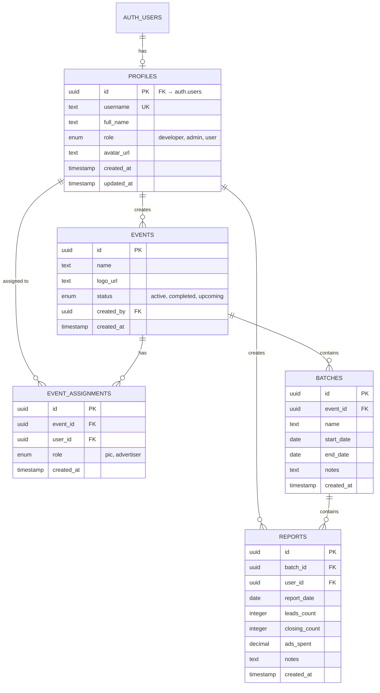

# Divination Dashboard - Frontend UI/UX Implementation Plan

## Overview

Aplikasi web manajemen event dan pelaporan kinerja iklan Meta Ads dengan fokus **mobile-first design** (70% user akses via mobile). Menggunakan pendekatan responsive yang dimulai dari mobile kemudian scale up ke tablet dan desktop.

---

## Flow Diagrams

### User Authentication Flow



### Role-Based Navigation Flow



### Page Structure & Navigation



### Event Page Data Flow



---

## 1. Design System & Visual Identity

### Color Palette

> [!NOTE]
> Fokus implementasi saat ini adalah **Light Mode**. Dark mode akan ditambahkan di fase berikutnya.

| Token | Light Mode | Dark Mode (Future) | Usage |
|-------|------------|-----------|-------|
| `--primary` | `#3B82F6` (Blue) | `#60A5FA` | Buttons, Links, Active States |
| `--primary-hover` | `#2563EB` | `#3B82F6` | Hover states |
| `--secondary` | `#8B5CF6` (Violet) | `#A78BFA` | Accents, Highlights |
| `--success` | `#10B981` | `#34D399` | Positive metrics, Sales |
| `--warning` | `#F59E0B` | `#FBBF24` | Alerts, Pending states |
| `--danger` | `#EF4444` | `#F87171` | Errors, Delete actions |
| `--bg-primary` | `#FFFFFF` | `#0F172A` | Main background |
| `--bg-secondary` | `#F8FAFC` | `#1E293B` | Cards, Sections |
| `--bg-tertiary` | `#F1F5F9` | `#334155` | Input fields, Dropdowns |
| `--text-primary` | `#0F172A` | `#F8FAFC` | Headlines, Body |
| `--text-secondary` | `#64748B` | `#94A3B8` | Captions, Labels |

### Typography

```css
/* Font Family */
--font-primary: 'Inter', system-ui, sans-serif;
--font-mono: 'JetBrains Mono', monospace; /* Untuk angka/money */

/* Font Sizes (Mobile First) */
--text-xs: 0.75rem;    /* 12px - Captions */
--text-sm: 0.875rem;   /* 14px - Body small */
--text-base: 1rem;     /* 16px - Body */
--text-lg: 1.125rem;   /* 18px - Subheadings */
--text-xl: 1.25rem;    /* 20px - Section titles */
--text-2xl: 1.5rem;    /* 24px - Page titles */
--text-3xl: 2rem;      /* 32px - Hero (Desktop) */
```

### Spacing & Sizing

```css
/* Spacing Scale */
--space-1: 0.25rem;  /* 4px */
--space-2: 0.5rem;   /* 8px */
--space-3: 0.75rem;  /* 12px */
--space-4: 1rem;     /* 16px */
--space-5: 1.25rem;  /* 20px */
--space-6: 1.5rem;   /* 24px */
--space-8: 2rem;     /* 32px */

/* Border Radius */
--radius-sm: 0.375rem;  /* 6px */
--radius-md: 0.5rem;    /* 8px */
--radius-lg: 0.75rem;   /* 12px */
--radius-xl: 1rem;      /* 16px */
--radius-full: 9999px;  /* Pills */
```

### Shadows & Effects

```css
--shadow-sm: 0 1px 2px rgba(0,0,0,0.05);
--shadow-md: 0 4px 6px -1px rgba(0,0,0,0.1);
--shadow-lg: 0 10px 15px -3px rgba(0,0,0,0.1);
--glass-bg: rgba(255,255,255,0.7);
--glass-blur: blur(10px);
```

---

## 2. Responsive Breakpoints

| Breakpoint | Min Width | Target Device |
|------------|-----------|---------------|
| `xs` | 0px | Small phones |
| `sm` | 480px | Large phones |
| `md` | 768px | Tablets |
| `lg` | 1024px | Small laptops |
| `xl` | 1280px | Desktops |

### Layout Strategy

```
Mobile (xs-sm): Single column, Bottom navigation, Full-width cards
Tablet (md): 2-column grid, Side drawer navigation
Desktop (lg+): 3-column grid, Fixed sidebar navigation
```

---

## 3. Navigation Structure

### 3.1 Mobile Navigation (Bottom Tab Bar)

**For Admin (3 tabs):**
```
┌─────────────────────────────────────────┐
│                                         │
│           [Page Content]                │
│                                         │
├─────────────────────────────────────────┤
│      🏠          👥          ⚙️         │
│     Home       People      Settings     │
└─────────────────────────────────────────┘
```

**For PIC/Advertiser (2 tabs):**
```
┌─────────────────────────────────────────┐
│                                         │
│           [Page Content]                │
│                                         │
├─────────────────────────────────────────┤
│         🏠              ⚙️              │
│        Home           Settings          │
└─────────────────────────────────────────┘
```

**Tab Items:**
1. **Home** (Dashboard) - `/dashboard` - Menampilkan semua event yang di-assign
2. **People** - `/admin/people` (Admin only)
3. **Settings** - Profile, Change Password, Logout

> [!NOTE]
> - Tab "People" hanya muncul untuk Admin
> - Tidak ada Action tab karena semua action sudah tersedia di halaman masing-masing:
>   - New Event → Dashboard (Admin)
>   - New Report → Event Detail Page (Advertiser)
>   - New Batch → Event Detail Page (Admin)

### 3.2 Desktop Navigation (Fixed Sidebar)

```
┌──────────────┬──────────────────────────────────┐
│              │                                  │
│   [Logo]     │                                  │
│              │                                  │
│  ─────────── │         [Page Content]           │
│  📊 Dashboard│                                  │
│  👥 People   │                                  │
│  ─────────── │                                  │
│              │                                  │
│  [User Card] │                                  │
│  ⚙️ Settings │                                  │
│  🚪 Logout   │                                  │
│              │                                  │
└──────────────┴──────────────────────────────────┘
```

### 3.3 Context Navigation (Event Page)

Di dalam Event Page, ada sub-navigation dengan **2 tabs**:

**Mobile:** Horizontal tabs
```
[ Overview | Reports ]
```

- **Overview:** Summary cards, trend chart, dan list advertiser performance
- **Reports:** History semua report dari advertiser di batch tersebut

**Desktop:** Sticky tabs di bawah event header

---

## 4. Page Layouts & UI Components

### 4.1 Login Page (`/login`)

```
┌─────────────────────────┐
│                         │
│      [App Logo]         │
│      "Divination"       │
│                         │
│  ┌───────────────────┐  │
│  │ Email             │  │
│  └───────────────────┘  │
│  ┌───────────────────┐  │
│  │ Password       👁️ │  │
│  └───────────────────┘  │
│                         │
│  [      Login         ] │
│                         │
│  Belum punya akun?      │
│  [Daftar di sini]       │
│                         │
└─────────────────────────┘
```

**Mobile Optimizations:**
- Input fields dengan height 48px (touch-friendly)
- Password toggle visibility
- Keyboard-aware layout

### 4.2 Register Page (`/register`)

```
┌─────────────────────────┐
│                         │
│      [App Logo]         │
│      "Divination"       │
│                         │
│  ┌───────────────────┐  │
│  │ Email             │  │
│  └───────────────────┘  │
│  ┌───────────────────┐  │
│  │ Display Name      │  │
│  └───────────────────┘  │
│  ┌───────────────────┐  │
│  │ Password       👁️ │  │
│  └───────────────────┘  │
│  ┌───────────────────┐  │
│  │ Confirm Password👁️ │  │
│  └───────────────────┘  │
│                         │
│  [     Register       ] │
│                         │
│  Sudah punya akun?      │
│  [Login di sini]        │
│                         │
└─────────────────────────┘
```

### 4.3 Dashboard Page (`/dashboard`)

**Mobile View (PIC/Advertiser):**
```
┌─────────────────────────┐
│  Divination      [👤]   │ ← Header with avatar
├─────────────────────────┤
│                         │
│  Selamat datang,        │
│  [Display Name] 👋      │
│                         │
│  ── My Events ───────── │
│                         │
│  ┌───────────────────┐  │
│  │ 📷 Event Logo     │  │
│  │ Event Name 1      │  │
│  │ Active • 3 Batches│  │
│  └───────────────────┘  │
│                         │
│  ┌───────────────────┐  │
│  │ 📷 Event Logo     │  │
│  │ Event Name 2      │  │
│  │ Active • 5 Batches│  │
│  └───────────────────┘  │
│                         │
└─────────────────────────┘
```

**Mobile View (Admin) - dengan Status Toggle:**
```
┌─────────────────────────┐
│  Divination      [👤]   │
├─────────────────────────┤
│                         │
│  Selamat datang,        │
│  Admin 👋               │
│                         │
│  ── Active Events ───── │
│                         │
│  ┌───────────────────┐  │
│  │ 📷 Event Name 1   │  │
│  │ 3 Batches         │  │
│  │ Status: [🟢 ON ]  │  │ ← Toggle switch
│  └───────────────────┘  │
│                         │
│  ┌───────────────────┐  │
│  │ 📷 Event Name 2   │  │
│  │ 5 Batches         │  │
│  │ Status: [🟢 ON ]  │  │
│  └───────────────────┘  │
│                         │
│  [+ New Event]          │
│                         │
│  ── Inactive Events ─── │
│                         │
│  ┌───────────────────┐  │
│  │ 📷 Old Event      │  │
│  │ 2 Batches         │  │
│  │ Status: [⚪ OFF]  │  │
│  └───────────────────┘  │
│                         │
└─────────────────────────┘
```

> [!NOTE]
> - Admin melihat SEMUA event dengan toggle active/inactive
> - Event inactive ditampilkan di section terpisah "Inactive Events" di bagian bawah
> - PIC/Advertiser hanya melihat event yang di-assign (tanpa toggle)

**Desktop View:** Grid 2-3 columns untuk Event Cards

**Unassigned User View:**
```
┌─────────────────────────┐
│                         │
│      [Empty State]      │
│         📭              │
│  Anda belum memiliki    │
│  akses ke event apapun  │
│                         │
│  Hubungi Admin untuk    │
│  mendapatkan akses      │
│                         │
└─────────────────────────┘
```

### 4.4 Event Detail Page (`/events/:id`)

**Mobile Layout - Overview Tab:**
```
┌─────────────────────────┐
│ ←  Event Name    [+Batch]│ ← Admin only: Add Batch button
├─────────────────────────┤
│ ┌─────────────────────┐ │
│ │ Batch: [Dropdown ▼] │ │ ← Batch selector with status
│ └─────────────────────┘ │
├─────────────────────────┤
│ [ Overview | Reports ]  │
├─────────────────────────┤
│                         │
│  ┌─────┐ ┌─────┐        │
│  │Spend│ │Leads│        │ ← Summary cards (2x2 grid)
│  │ 25M │ │ 150 │        │
│  └─────┘ └─────┘        │
│  ┌─────┐ ┌─────┐        │
│  │Sales│ │ CPL │        │
│  │  45 │ │ 167K│        │
│  └─────┘ └─────┘        │
│                         │
│  ── Trend Chart ─────── │
│  [Line Chart: Daily]    │
│                         │
│  ── Advertisers ─────── │
│  ┌───────────────────┐  │
│  │ 👤 John Doe       │  │
│  │ Spend: 10M        │  │
│  │ Leads: 50 Sales:12│  │
│  └───────────────────┘  │
│                         │
│  ── PIC List ────────── │
│  ┌───────────────────┐  │
│  │ 👤 Sarah (PIC)    │  │
│  └───────────────────┘  │
│                         │
│           [➕]          │ ← Floating button: New Report
│                         │
└─────────────────────────┘
```

> [!NOTE]
> - **Empty State:** Jika batch tidak memiliki data report, tampilkan ilustrasi "Belum ada data"
> - **Floating Button (+):** Hanya visible untuk Advertiser dan Admin

**Mobile Layout - Reports Tab:**
```
┌─────────────────────────┐
│ ←  Event Name           │
├─────────────────────────┤
│ ┌─────────────────────┐ │
│ │ Batch: [Dropdown ▼] │ │
│ └─────────────────────┘ │
├─────────────────────────┤
│ [ Overview | Reports ]  │
├─────────────────────────┤
│                         │
│  ── Time Filter ─────── │
│  [All][Month][Week][Day]│
│                         │
│  ── Report History ──── │
│                         │
│  ┌───────────────────┐  │
│  │ 📅 Jan 15, 2026   │  │
│  │ Rp 2.000.000      │  │
│  │ 10 Leads • 3 Sales│  │
│  │ By: John Doe      │  │
│  │         [Edit] ← │  │ ← Muncul jika creator/admin
│  └───────────────────┘  │
│                         │
│  ┌───────────────────┐  │
│  │ 📅 Jan 14, 2026   │  │
│  │ Rp 1.500.000      │  │
│  │ 8 Leads • 2 Sales │  │
│  │ By: Jane Smith    │  │
│  │                   │  │ ← Tidak ada Edit (bukan creator)
│  └───────────────────┘  │
│                         │
│  ┌───────────────────┐  │
│  │ 📅 Jan 13, 2026   │  │
│  │ Rp 3.000.000      │  │
│  │ 15 Leads • 5 Sales│  │
│  │ By: John Doe      │  │
│  │         [Edit] ← │  │
│  └───────────────────┘  │
│                         │
└─────────────────────────┘
```

> [!IMPORTANT]
> **Edit Permission Logic:**
> - **Advertiser:** Hanya bisa edit report yang dia buat sendiri
> - **Admin:** Bisa edit semua report
> - **PIC:** Read-only, tidak bisa edit report apapun

**Time Filter (Horizontal Pills):**
```
[ All Time ] [ This Month ] [ This Week ] [ Today ]
```

### 4.5 New Report Page (`/events/:id/report/new`)

**Full-page form (accessed via floating + button):**
```
┌─────────────────────────┐
│ ←  New Report           │ ← Back button (no bottom nav)
├─────────────────────────┤
│                         │
│  Reporting Period       │
│  ┌───────────────────┐  │
│  │ 📅 Select dates... │  │ ← Opens calendar sub-page
│  └───────────────────┘  │
│                         │
│  Spend (IDR)            │
│  ┌───────────────────┐  │
│  │ Rp 5.000.000      │  │
│  └───────────────────┘  │
│                         │
│  Leads                  │
│  ┌───────────────────┐  │
│  │ 25                │  │
│  └───────────────────┘  │
│                         │
│  Sales                  │
│  ┌───────────────────┐  │
│  │ 8                 │  │
│  └───────────────────┘  │
│                         │
│  [    Submit Report   ] │
│                         │
└─────────────────────────┘
```

**Select Reporting Period (sub-page with calendar):**
```
┌─────────────────────────┐
│ ←  Select Period        │
├─────────────────────────┤
│                         │
│  ┌───────────────────┐  │
│  │  January 2026     │  │
│  ├───┬───┬───┬───┬───┤  │
│  │ S │ M │ T │ W │ T │  │
│  ├───┼───┼───┼───┼───┤  │
│  │   │   │   │ 1 │ 2 │  │
│  │ 3 │[4]│ 5 │ 6 │[7]│  │ ← Date range
│  │ 10│ 11│ 12│ 13│ 14│  │
│  └───┴───┴───┴───┴───┘  │
│                         │
│  Selected: Jan 4 - Jan 7│
│                         │
│  [    Confirm Dates   ] │
│                         │
└─────────────────────────┘
```

### 4.5b Add New Batch Page (`/events/:id/batch/new`) - Admin Only

```
┌─────────────────────────┐
│ ←  Add New Batch        │ ← Back button (no bottom nav)
├─────────────────────────┤
│                         │
│  Nama Batch             │
│  ┌───────────────────┐  │
│  │ Batch 14          │  │
│  └───────────────────┘  │
│                         │
│  Rentang Tanggal        │
│  ┌───────────────────┐  │
│  │ 📅 Jan 1 - Jan 15 │  │ ← Date range picker
│  └───────────────────┘  │
│                         │
│  Catatan (Notes)        │
│  ┌───────────────────┐  │
│  │ Target: 100 leads │  │
│  │ Budget: 10jt      │  │
│  │                   │  │
│  └───────────────────┘  │
│                         │
│  [    Simpan Batch    ] │
│                         │
└─────────────────────────┘
```

### 4.5c Create New Event Page (`/events/new`) - Admin Only

```
┌─────────────────────────┐
│ ←  Buat Acara Baru      │ ← Back button
├─────────────────────────┤
│                         │
│  Event Name             │
│  ┌───────────────────┐  │
│  │ Webinar Marketing │  │
│  └───────────────────┘  │
│                         │
│  Event Logo             │
│  ┌───────────────────┐  │
│  │   🖼 Upload Logo   │  │
│  │                   │  │
│  └───────────────────┘  │
│                         │
│  [    Buat Event      ] │
│                         │
└─────────────────────────┘
```

### 4.6 People Management Page (`/admin/people`)

**Mobile View:**
```
┌─────────────────────────┐
│  People Management      │
├─────────────────────────┤
│                         │
│  🔍 Search users...     │
│                         │
│  [All][Unassigned][Assigned]│ ← Filter tabs
│                         │
│  ┌───────────────────┐  │
│  │ 👤 John Doe       │  │
│  │ john@email.com    │  │
│  │ ⚪ Unassigned      │  │ ← Status badge
│  └───────────────────┘  │
│                         │
│  ┌───────────────────┐  │
│  │ 👤 Jane Smith     │  │
│  │ jane@email.com    │  │
│  │ 🟢 Assigned (2)    │  │ ← Event count
│  └───────────────────┘  │
│                         │
│  ┌───────────────────┐  │
│  │ 👤 Admin User     │  │
│  │ admin@email.com   │  │
│  │ 🔵 Admin          │  │ ← Admin badge
│  └───────────────────┘  │
│                         │
└─────────────────────────┘
```

**User Detail Page (`/admin/people/:id`):**
```
┌─────────────────────────┐
│ ←  User Details         │
├─────────────────────────┤
│                         │
│  👤 Jane Smith          │
│  jane@email.com         │
│                         │
│  ── Current Assignments │
│  ┌───────────────────┐  │
│  │ Event A           │  │
│  │ Role: Advertiser  │  │
│  │         [Revoke]  │  │
│  └───────────────────┘  │
│  ┌───────────────────┐  │
│  │ Event B           │  │
│  │ Role: PIC         │  │
│  │         [Revoke]  │  │
│  └───────────────────┘  │
│                         │
│  [+ Assign to Event]    │
│                         │
└─────────────────────────┘
```

> [!IMPORTANT]
> **Admin User Exception:**
> - Jika user memiliki role **Admin**, tombol "Assign to Event" **tidak muncul**
> - Admin sudah memiliki akses ke semua event secara default

**Event Selection Page (`/admin/people/:id/assign`):**
```
┌─────────────────────────┐
│ ←  Select Event         │
├─────────────────────────┤
│                         │
│  Assign to: Jane Smith  │
│                         │
│  ── Available Events ── │ ← Only events user NOT in
│                         │
│  ┌───────────────────┐  │
│  │ Event C           │  │
│  │ 👤 2 PIC • 5 Adv   │  │ ← Team stats
│  └───────────────────┘  │
│                         │
│  ┌───────────────────┐  │
│  │ Event D           │  │
│  │ 👤 1 PIC • 3 Adv   │  │
│  └───────────────────┘  │
│                         │
└─────────────────────────┘
```

**Role Assignment Popup (after selecting event):**
```
┌─────────────────────────┐
│                         │
│  Pilih Role             │
│                         │
│  ┌─────────┐ ┌─────────┐│
│  │   PIC   │ │Advertiser││ ← Choice chips
│  └─────────┘ └─────────┘│
│                         │
│  [  Cancel  ] [ Assign ]│
│                         │
└─────────────────────────┘
```

### 4.7 Settings Page (`/settings`)

```
┌─────────────────────────┐
│  Settings               │
├─────────────────────────┤
│                         │
│  ┌───────────────────┐  │
│  │ 👤 Edit Profile    >│  │
│  └───────────────────┘  │
│  ┌───────────────────┐  │
│  │ 🔒 Change Password>│  │
│  └───────────────────┘  │
│  ┌───────────────────┐  │
│  │ ❓ Help Center    >│  │
│  └───────────────────┘  │
│                         │
│  ┌───────────────────┐  │
│  │ 🚪 Logout         │  │ ← Red text
│  └───────────────────┘  │
│                         │
└─────────────────────────┘
```

### 4.8 Change Password Page (`/settings/password`)

```
┌─────────────────────────┐
│ ←  Change Password      │
├─────────────────────────┤
│                         │
│  Current Password       │
│  ┌───────────────────┐  │
│  │ ••••••••       👁️ │  │
│  └───────────────────┘  │
│                         │
│  New Password           │
│  ┌───────────────────┐  │
│  │ ••••••••       👁️ │  │
│  └───────────────────┘  │
│  ℹ️ Min 8 characters    │
│                         │
│  Confirm New Password   │
│  ┌───────────────────┐  │
│  │ ••••••••       👁️ │  │
│  └───────────────────┘  │
│                         │
│  [ Update Password ]    │
│                         │
└─────────────────────────┘
```

### 4.9 Help Center Page (`/settings/help`)

```
┌─────────────────────────┐
│ ←  Help Center          │
├─────────────────────────┤
│                         │
│  ── Admin Support ───── │
│  ┌───────────────────┐  │
│  │ 📧 admin@company.com│  │
│  │ 📞 +62 812 xxx xxx │  │
│  └───────────────────┘  │
│                         │
│  ── Developer Team ──── │
│  ┌───────────────────┐  │
│  │ 📧 dev@company.com │  │
│  │ 📞 +62 821 xxx xxx │  │
│  └───────────────────┘  │
│                         │
└─────────────────────────┘
```

---

## 5. Component Library

### Core Components

| Component | Description | Mobile Behavior |
|-----------|-------------|-----------------|
| `Button` | Primary, Secondary, Ghost, Danger | Full-width on mobile |
| `Input` | Text, Password, Number | 48px height, large touch target |
| `Select/Dropdown` | Native select on mobile | Uses native picker |
| `DatePicker` | Single & Range mode | Native date input on mobile |
| `Card` | Event card, Report card | Stack vertically |
| `Modal` | Dialogs, Confirmations | Full-screen on mobile |
| `BottomSheet` | Mobile-only slide-up panel | 90% height max |
| `Tabs` | Navigation tabs | Horizontal scroll with fade |
| `Toast` | Success, Error, Info | Bottom position |
| `Avatar` | User avatars | 32px mobile, 40px desktop |
| `Badge` | Status indicators | Role badges (Admin, PIC, etc) |
| `Chart` | Line, Bar charts | Touch-enabled, pinch zoom |
| `EmptyState` | Placeholder illustrations | Centered with CTA |
| `Skeleton` | Loading placeholders | Match content shape |

### Mobile-Specific Components

| Component | Purpose |
|-----------|---------|
| `BottomNav` | Fixed bottom navigation bar |
| `FAB` | Floating Action Button |
| `SwipeableCard` | Swipe to reveal actions |
| `PullToRefresh` | Refresh gesture |

---

## 6. Interaction & Animation Guidelines

### Touch Interactions

- **Tap targets:** Minimum 44x44px
- **Swipe:** Left/Right on cards for quick actions
- **Long press:** Context menu on report items
- **Pull down:** Refresh data

### Micro-animations

```css
/* Transitions */
--transition-fast: 150ms ease;
--transition-normal: 250ms ease;
--transition-slow: 350ms ease;

/* Common animations */
- Button press: scale(0.98)
- Modal entrance: slide-up + fade
- Toast: slide-in from bottom
- Page transition: slide left/right
- Loading: skeleton shimmer
```

---

## 7. Accessibility Considerations

- **Color contrast:** WCAG AA compliant (4.5:1 for text)
- **Focus states:** Visible focus rings for keyboard navigation
- **Screen reader:** ARIA labels on interactive elements
- **Reduced motion:** Respect `prefers-reduced-motion`
- **Font scaling:** Support up to 200% text zoom

---

## 8. Tech Stack

Berdasarkan requirement mobile-first dan kompleksitas aplikasi:

| Layer | Technology | Rationale |
|-------|------------|-----------|
| Framework | **Next.js 16** (App Router) | SSR, File-based routing, Serverless-ready |
| Database | **Supabase** | PostgreSQL, Real-time, Row Level Security |
| Auth | **Auth.js** (NextAuth.js) | Flexible auth, credentials provider, session management |
| Styling | **Tailwind CSS** | Utility-first, rapid development, built-in responsive |
| State | **React Context** + **SWR** | Simple state + data fetching with caching |
| Charts | **Chart.js** | Lightweight, responsive, touch-friendly |
| Icons | **Lucide React** | Lightweight, consistent |
| Date Picker | **react-day-picker** | Lightweight, customizable |
| Forms | **React Hook Form** | Performance, validation |
| Deployment | **Vercel** (recommended) | Serverless, Edge functions, Easy Supabase integration |

> [!NOTE]
> **Serverless Architecture:** Aplikasi akan di-deploy sebagai serverless web app. Tidak memerlukan server dedicated - semua backend logic ditangani oleh Supabase dan Next.js API routes/Server Actions.

---

## 9. File Structure

```
/src
├── /app
│   ├── layout.js              # Root layout with providers
│   ├── page.js                # Redirect to /dashboard
│   ├── /login
│   │   └── page.js
│   ├── /register
│   │   └── page.js
│   ├── /dashboard
│   │   └── page.js
│   ├── /events
│   │   └── /[id]
│   │       └── page.js
│   ├── /admin
│   │   └── /people
│   │       └── page.js
│   └── /settings
│       └── /password
│           └── page.js
├── /components
│   ├── /ui                    # Base components
│   │   ├── Button.jsx
│   │   ├── Input.jsx
│   │   ├── Card.jsx
│   │   ├── Modal.jsx
│   │   ├── BottomSheet.jsx
│   │   └── ...
│   ├── /layout
│   │   ├── Header.jsx
│   │   ├── BottomNav.jsx
│   │   ├── Sidebar.jsx
│   │   └── PageContainer.jsx
│   ├── /dashboard
│   │   └── EventCard.jsx
│   ├── /event
│   │   ├── BatchSelector.jsx
│   │   ├── SummaryCards.jsx
│   │   ├── TrendChart.jsx
│   │   ├── ReportHistory.jsx
│   │   └── NewReportForm.jsx
│   └── /admin
│       └── UserCard.jsx
├── /styles
│   ├── globals.css            # Design tokens & base styles
│   ├── components.css         # Component-specific styles
│   └── utilities.css          # Helper classes
├── /lib
│   ├── api.js                 # API functions
│   ├── auth.js                # Auth utilities
│   └── utils.js               # Helper functions
├── /hooks
│   ├── useAuth.js
│   ├── useEvents.js
│   └── useBatch.js
└── /context
    └── AuthContext.js
```

---

## 10. Verification Plan

### Browser Testing (Visual & Functional)

Setelah implementasi, akan dilakukan testing menggunakan browser tool:

1. **Mobile Viewport Testing** (375px width)
   - Verifikasi bottom navigation muncul
   - Verifikasi cards stack vertically
   - Test form input touch targets

2. **Desktop Viewport Testing** (1280px width)
   - Verifikasi sidebar navigation muncul
   - Verifikasi grid layout untuk cards
   - Test hover states

3. **Responsive Transition Testing**
   - Resize browser dari mobile ke desktop
   - Verifikasi layout berubah dengan smooth

### Manual Verification by User

1. **Cross-device testing** - User mencoba di HP dan laptop mereka
2. **Real touch interaction** - Swipe, tap, scroll behavior
3. **Usability feedback** - Apakah flow intuitive?

---

## Confirmed Design Decisions ✅

| Decision | Choice | Notes |
|----------|--------|-------|
| **Dark Mode** | Light mode only | Struktur CSS siap untuk dark mode di masa depan |
| **Chart Library** | Chart.js | Lebih ringan untuk mobile |
| **PWA Support** | Tidak | Website biasa saja |
| **Logo** | Text "Divination" | Tanpa gambar, typography-based |
| **Animasi** | Minimal to Moderate | Optimized untuk low-spec mobile |

---

## 11. Database Schema (Supabase)

> [!IMPORTANT]
> **Role Separation Philosophy:**
> - `profiles.role` = **App-level permission** (who can do what in the system)
> - `event_assignments.role` = **Event-specific role** (what they do in that specific event)
> 
> This allows one user to be PIC on Event A and Advertiser on Event B.

### Entity Relationship Diagram



### Role Definitions

#### App-Level Roles (`profiles.role`)

| Role | Description | Permissions |
|------|-------------|-------------|
| `developer` | Super admin, system owner | All admin permissions + can promote users to admin |
| `admin` | Event manager | Create events, assign users to events, view all events |
| `user` | Regular user | View assigned events only, create reports (if advertiser) |

#### Event-Level Roles (`event_assignments.role`)

| Role | Description | Permissions in Event |
|------|-------------|---------------------|
| `pic` | Person in Charge | Monitor event, view all reports, read-only |
| `advertiser` | Ad runner | Create/edit own reports, view event data |

### Permission Matrix

| Action | Developer | Admin | User (PIC) | User (Advertiser) |
|--------|-----------|-------|------------|-------------------|
| Promote user to Admin | ✅ | ❌ | ❌ | ❌ |
| Create/Edit Events | ✅ | ✅ | ❌ | ❌ |
| Create/Edit Batches | ✅ | ✅ | ❌ | ❌ |
| Assign users to events | ✅ | ✅ | ❌ | ❌ |
| View ALL events | ✅ | ✅ | ❌ | ❌ |
| View assigned events | ✅ | ✅ | ✅ | ✅ |
| View reports in event | ✅ | ✅ | ✅ | ✅ |
| Create reports | ✅ | ✅ | ❌ | ✅ |
| Edit own reports | ✅ | ✅ | ❌ | ✅ |
| Edit all reports | ✅ | ✅ | ❌ | ❌ |

### Tables Detail

#### 1. `profiles` (extends Supabase Auth)

| Column | Type | Constraints | Description |
|--------|------|-------------|-------------|
| `id` | UUID | PK, FK → auth.users | Primary key, linked to Supabase Auth |
| `username` | TEXT | UNIQUE, NOT NULL | Unique username for display |
| `full_name` | TEXT | NOT NULL | Display name |
| `role` | ENUM | NOT NULL, DEFAULT 'user' | `developer`, `admin`, `user` |
| `avatar_url` | TEXT | NULLABLE | Profile picture URL |
| `created_at` | TIMESTAMPTZ | DEFAULT NOW() | - |
| `updated_at` | TIMESTAMPTZ | DEFAULT NOW() | - |

#### 2. `events`

| Column | Type | Constraints | Description |
|--------|------|-------------|-------------|
| `id` | UUID | PK, DEFAULT gen_random_uuid() | Primary key |
| `name` | TEXT | NOT NULL | Event name |
| `logo_url` | TEXT | NULLABLE | Event logo image URL |
| `status` | ENUM | NOT NULL, DEFAULT 'active' | `active`, `completed`, `upcoming` |
| `created_by` | UUID | FK → profiles.id | Creator/owner |
| `created_at` | TIMESTAMPTZ | DEFAULT NOW() | - |

#### 3. `batches`

| Column | Type | Constraints | Description |
|--------|------|-------------|-------------|
| `id` | UUID | PK, DEFAULT gen_random_uuid() | Primary key |
| `event_id` | UUID | FK → events.id, ON DELETE CASCADE | Parent event |
| `name` | TEXT | NOT NULL | "Batch 1", "Batch 2", etc. |
| `start_date` | DATE | NOT NULL | Batch start date |
| `end_date` | DATE | NOT NULL | Batch end date |
| `notes` | TEXT | NULLABLE | Optional notes |
| `created_at` | TIMESTAMPTZ | DEFAULT NOW() | - |

#### 4. `event_assignments`

| Column | Type | Constraints | Description |
|--------|------|-------------|-------------|
| `id` | UUID | PK, DEFAULT gen_random_uuid() | Primary key |
| `event_id` | UUID | FK → events.id, ON DELETE CASCADE | - |
| `user_id` | UUID | FK → profiles.id, ON DELETE CASCADE | - |
| `role` | ENUM | NOT NULL | `pic`, `advertiser` |
| `created_at` | TIMESTAMPTZ | DEFAULT NOW() | - |
| - | - | UNIQUE(event_id, user_id) | Prevent duplicate assignments |

#### 5. `reports`

| Column | Type | Constraints | Description |
|--------|------|-------------|-------------|
| `id` | UUID | PK, DEFAULT gen_random_uuid() | Primary key |
| `batch_id` | UUID | FK → batches.id, ON DELETE CASCADE | - |
| `user_id` | UUID | FK → profiles.id | Reporter (must be advertiser in event) |
| `report_date` | DATE | NOT NULL | Report date |
| `leads_count` | INTEGER | NOT NULL, DEFAULT 0 | Jumlah leads |
| `closing_count` | INTEGER | NOT NULL, DEFAULT 0 | Jumlah closing/sales |
| `ads_spent` | DECIMAL(15,2) | NOT NULL, DEFAULT 0 | Biaya iklan (IDR) |
| `notes` | TEXT | NULLABLE | Catatan tambahan |
| `created_at` | TIMESTAMPTZ | DEFAULT NOW() | - |

### Row Level Security (RLS) Policies

#### `profiles`
| Policy | Action | Using | With Check |
|--------|--------|-------|------------|
| View all profiles | SELECT | `true` (authenticated) | - |
| Update own profile | UPDATE | `auth.uid() = id` | `auth.uid() = id` |
| Developer promote to admin | UPDATE | `is_developer()` | `is_developer()` |

#### `events`
| Policy | Action | Using | With Check |
|--------|--------|-------|------------|
| Admins+ view all | SELECT | `is_admin_or_higher()` | - |
| Assigned users view | SELECT | `has_event_access(id)` | - |
| Admins+ insert | INSERT | - | `is_admin_or_higher()` |
| Admins+ update | UPDATE | `is_admin_or_higher()` | `is_admin_or_higher()` |
| Admins+ delete | DELETE | `is_admin_or_higher()` | - |

#### `batches`
| Policy | Action | Using | With Check |
|--------|--------|-------|------------|
| View if event access | SELECT | `has_event_access(event_id)` | - |
| Admins+ insert | INSERT | - | `is_admin_or_higher()` |
| Admins+ update/delete | UPDATE, DELETE | `is_admin_or_higher()` | `is_admin_or_higher()` |

#### `event_assignments`
| Policy | Action | Using | With Check |
|--------|--------|-------|------------|
| View own assignments | SELECT | `user_id = auth.uid()` | - |
| Admins+ view all | SELECT | `is_admin_or_higher()` | - |
| Admins+ manage | INSERT, UPDATE, DELETE | `is_admin_or_higher()` | `is_admin_or_higher()` |

#### `reports`
| Policy | Action | Using | With Check |
|--------|--------|-------|------------|
| View if event access | SELECT | `has_event_access_via_batch(batch_id)` | - |
| Advertiser create own | INSERT | - | `is_advertiser_in_event(batch_id) AND user_id = auth.uid()` |
| Advertiser edit own | UPDATE | `user_id = auth.uid()` | `user_id = auth.uid()` |
| Admins+ manage all | ALL | `is_admin_or_higher()` | `is_admin_or_higher()` |

### Helper Functions

```sql
-- Check if current user is developer
CREATE OR REPLACE FUNCTION is_developer()
RETURNS BOOLEAN AS $$
  SELECT EXISTS (
    SELECT 1 FROM profiles
    WHERE id = auth.uid() AND role = 'developer'
  );
$$ LANGUAGE sql SECURITY DEFINER;

-- Check if current user is admin or higher (admin/developer)
CREATE OR REPLACE FUNCTION is_admin_or_higher()
RETURNS BOOLEAN AS $$
  SELECT EXISTS (
    SELECT 1 FROM profiles
    WHERE id = auth.uid() AND role IN ('admin', 'developer')
  );
$$ LANGUAGE sql SECURITY DEFINER;

-- Check if current user has access to an event
CREATE OR REPLACE FUNCTION has_event_access(event_uuid UUID)
RETURNS BOOLEAN AS $$
  SELECT is_admin_or_higher() OR EXISTS (
    SELECT 1 FROM event_assignments
    WHERE event_id = event_uuid AND user_id = auth.uid()
  );
$$ LANGUAGE sql SECURITY DEFINER;

-- Check if current user has access to event via batch
CREATE OR REPLACE FUNCTION has_event_access_via_batch(batch_uuid UUID)
RETURNS BOOLEAN AS $$
  SELECT EXISTS (
    SELECT 1 FROM batches b
    WHERE b.id = batch_uuid AND has_event_access(b.event_id)
  );
$$ LANGUAGE sql SECURITY DEFINER;

-- Check if current user is advertiser in the event (via batch)
CREATE OR REPLACE FUNCTION is_advertiser_in_event(batch_uuid UUID)
RETURNS BOOLEAN AS $$
  SELECT is_admin_or_higher() OR EXISTS (
    SELECT 1 FROM batches b
    JOIN event_assignments ea ON ea.event_id = b.event_id
    WHERE b.id = batch_uuid 
      AND ea.user_id = auth.uid() 
      AND ea.role = 'advertiser'
  );
$$ LANGUAGE sql SECURITY DEFINER;

-- Get user's role in a specific event
CREATE OR REPLACE FUNCTION get_event_role(event_uuid UUID)
RETURNS TEXT AS $$
  SELECT ea.role FROM event_assignments ea
  WHERE ea.event_id = event_uuid AND ea.user_id = auth.uid()
  LIMIT 1;
$$ LANGUAGE sql SECURITY DEFINER;
```

### Indexes

```sql
-- Performance indexes
CREATE INDEX idx_profiles_role ON profiles(role);
CREATE INDEX idx_events_status ON events(status);
CREATE INDEX idx_events_created_by ON events(created_by);
CREATE INDEX idx_batches_event_id ON batches(event_id);
CREATE INDEX idx_batches_dates ON batches(start_date, end_date);
CREATE INDEX idx_event_assignments_event ON event_assignments(event_id);
CREATE INDEX idx_event_assignments_user ON event_assignments(user_id);
CREATE INDEX idx_event_assignments_composite ON event_assignments(event_id, user_id, role);
CREATE INDEX idx_reports_batch_id ON reports(batch_id);
CREATE INDEX idx_reports_user_id ON reports(user_id);
CREATE INDEX idx_reports_date ON reports(report_date);
```

### Environment Variables

| Variable | Source | Description |
|----------|--------|-------------|
| `NEXT_PUBLIC_SUPABASE_URL` | Dashboard → Settings → API | Project URL |
| `NEXT_PUBLIC_SUPABASE_PUBLISHABLE_KEY` | Dashboard → Settings → API → API Keys | Client-side key |
| `SUPABASE_SECRET_KEY` | Dashboard → Settings → API → API Keys | Server-side only |
| `DATABASE_URL` | Dashboard → Connect → ORMs | Transaction mode (pooled) |
| `DIRECT_URL` | Dashboard → Connect → ORMs | Session mode (migrations) |
| `NEXTAUTH_SECRET` | Generate: `openssl rand -base64 32` | Session encryption |

> [!NOTE]
> **JWT Verification:** Using new asymmetric JWT signing keys (RS256). No JWT secret needed in env - verification done via JWKS endpoint: `{SUPABASE_URL}/auth/v1/.well-known/jwks.json`

